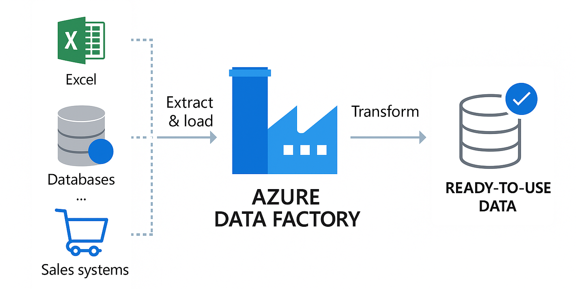
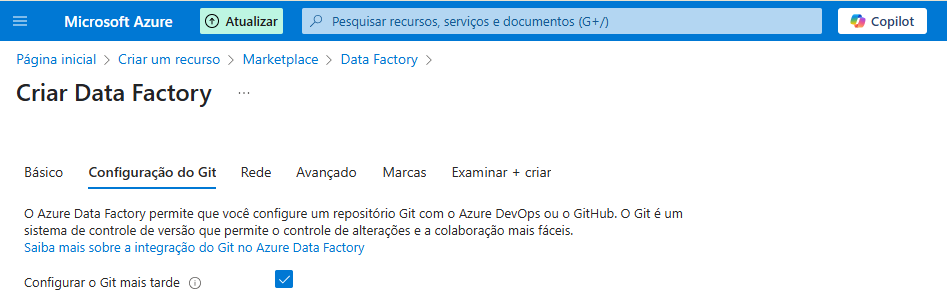
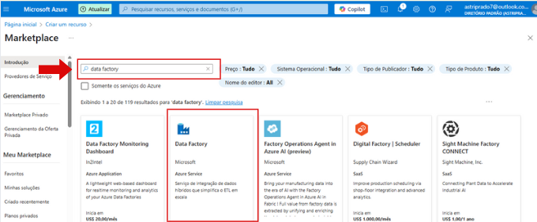
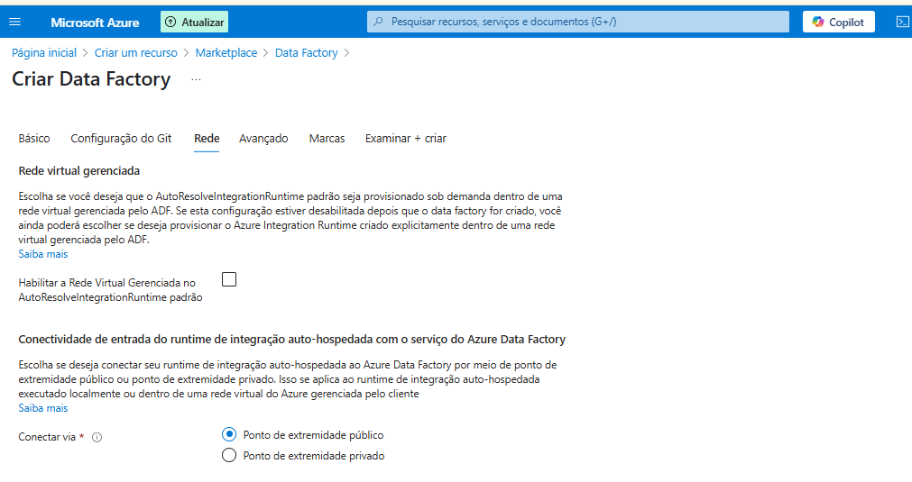
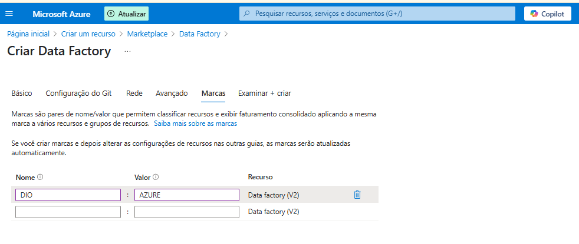
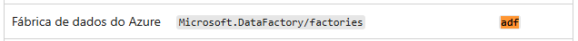

# Projeto: Monitoramento de Custos com Azure Data Factory (ADF)

## 📌 Descrição

Este projeto tem como objetivo guiar a criação de um ambiente no **Azure Data Factory (ADF)** para monitoramento de custos, utilizando o portal do Azure. Ele foi desenvolvido como parte das atividades do bootcamp **Microsoft AI for Tech – Azure Databricks**, promovido pela plataforma **DIO**.

## ☁️ O que é Azure e Azure Data Factory?

**Microsoft Azure** é a plataforma de computação em nuvem da Microsoft, oferecendo serviços como armazenamento de dados, VMs, IA, segurança, redes e muito mais — tudo via internet.

**Azure Data Factory (ADF)** é um serviço de integração de dados baseado na nuvem, que permite criar pipelines de dados para movimentar, transformar e consolidar dados de diferentes fontes.

### 🏭 ADF em resumo:

- **Coleta** dados de diversas fontes;
- **Transforma** os dados conforme regras definidas;
- **Entrega** os dados estruturados para uso em análises.

## 🎯 Objetivo do Projeto

Demonstrar, passo a passo, como criar manualmente um ambiente de Azure Data Factory pelo portal do Azure, com foco no monitoramento e controle de custos.

---

## 🛠️ Passo a Passo: Criando sua Data Factory no Portal Azure

### 1. Criar uma Conta no Azure

#### Tipos de Conta:

- **Conta Gratuita (Free Account)**  
  US$200 de crédito por 30 dias e serviços gratuitos por 12 meses.  
  👉 [azure.microsoft.com/free](https://azure.microsoft.com/pt-br/free)

- **Conta Estudante (Azure for Students)**  
  US$100 em crédito, sem exigência de cartão de crédito.  
  👉 [azure.microsoft.com/free/students](https://azure.microsoft.com/pt-br/free/students/)

- **Conta Paga (Pay-As-You-Go)**  
  Pagamento conforme uso.  
  👉 [portal.azure.com](https://portal.azure.com)

⚠️ **Importante:** Configure alertas de custo para evitar cobranças inesperadas.

---

### 2. Criar uma Data Factory

No painel principal do Azure, clique em **"Criar um recurso"**.



Pesquise por **"Data Factory"**, clique e selecione **"Criar"**.



---

### 3. Configuração Básica

- **Assinatura:** Selecione sua assinatura.
- **Grupo de Recursos:** Escolha um existente ou crie um novo (ex.: `rg-projeto-monitoramento`).
- **Nome da Data Factory:** Use um nome padronizado (ex.: `adf-monitoramento-custos`).
- **Região:** Utilize regiões como `East US` ou `East US 2`.
- **Versão:** Selecione **V2**.



🔗 [Padrões de nomenclatura recomendados pela Microsoft](https://learn.microsoft.com/pt-br/azure/cloud-adoption-framework/ready/azure-best-practices/resource-abbreviations)

---

### 4. Configurações Adicionais

#### Git:

Pode ser integrado posteriormente com GitHub ou Azure DevOps.


#### Rede:

Manter o padrão com **ponto de extremidade pública**.


#### Avançado:

Manter a configuração padrão de criptografia.



#### Marcas (Tags):

Exemplo:
```text
Nome: DIO
Valor: AZURE
```


---

### 5. Finalizar a Criação

- Clique em **"Examinar + Criar"**.
- Valide as configurações.
- Clique em **"Criar"**.



---

## 💰 Monitoramento de Custos

Após a implantação, acesse o recurso criado.

Vá em **"Gerenciamento de custos"** para:

- Visualizar custos;
- Criar alertas e orçamentos;
- Obter recomendações de compliance.




---

## 📄 Licença

Este projeto segue a licença [MIT](LICENSE).

---

## 🙋‍♀️ Contribuindo

Pull requests são bem-vindos! Para contribuições maiores, abra uma issue primeiro para discutir as mudanças propostas.

---

## 🌐 Referências

- [Microsoft Learn - Azure Data Factory](https://learn.microsoft.com/pt-br/azure/data-factory/)
- [Documentação Oficial do Azure](https://learn.microsoft.com/pt-br/azure/)
