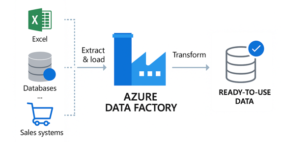
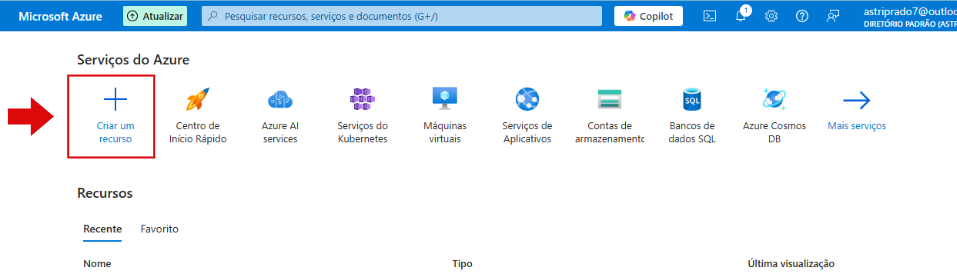
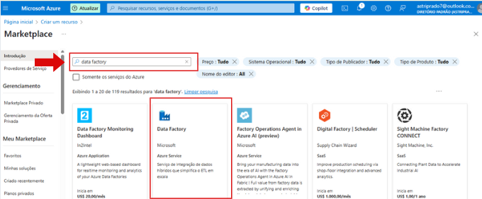
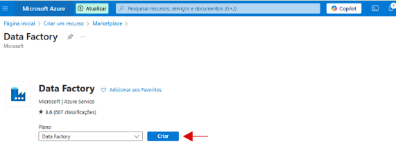
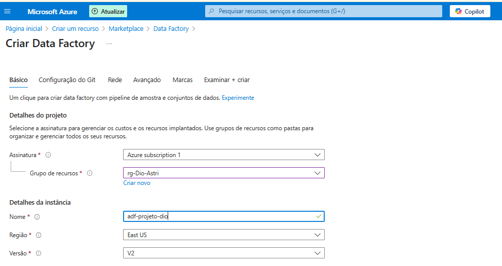
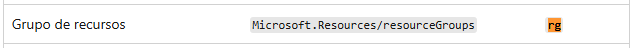
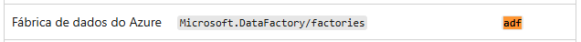
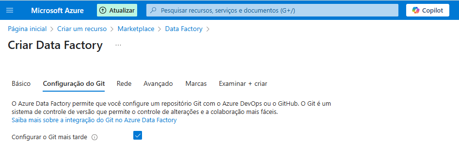
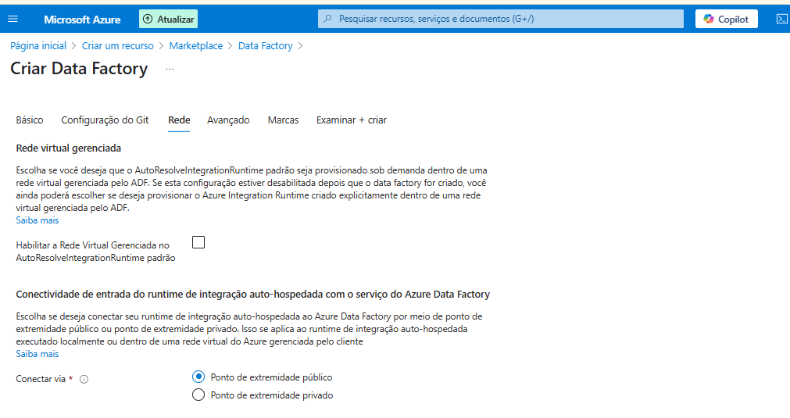
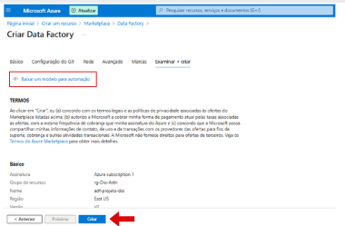

# Projeto: Monitoramento de Custos com Azure Data Factory (ADF)

## 📌 Descrição

Este projeto tem como objetivo guiar a criação de um ambiente no **Azure Data Factory (ADF)** para monitoramento de custos, utilizando o portal do Azure. Ele foi desenvolvido como parte das atividades do bootcamp **Microsoft AI for Tech – Azure Databricks**, promovido pela plataforma **DIO**.

## ☁️ O que é Azure e Azure Data Factory?

**Microsoft Azure** é a plataforma de computação em nuvem da Microsoft, oferecendo serviços como armazenamento de dados, VMs, IA, segurança, redes e muito mais — tudo via internet.

**Azure Data Factory (ADF)** é um serviço de integração de dados baseado na nuvem, que permite criar pipelines de dados para movimentar, transformar e consolidar dados de diferentes fontes.

### 🏭 ADF em resumo:

- **Coleta** dados de diversas fontes;
- **Transforma** os dados conforme regras definidas;
- **Entrega** os dados estruturados para uso em análises.

## 🎯 Objetivo do Projeto

Demonstrar, passo a passo, como criar manualmente um ambiente de Azure Data Factory pelo portal do Azure, com foco no monitoramento e controle de custos.

---

## 🛠️ Passo a Passo: Criando sua Data Factory no Portal Azure

### 1. Criar uma Conta no Azure

#### Tipos de Conta:

- **Conta Gratuita (Free Account)**  
  US$200 de crédito por 30 dias e serviços gratuitos por 12 meses.  
  👉 [azure.microsoft.com/free](https://azure.microsoft.com/pt-br/free)

- **Conta Estudante (Azure for Students)**  
  US$100 em crédito, sem exigência de cartão de crédito.  
  👉 [azure.microsoft.com/free/students](https://azure.microsoft.com/pt-br/free/students/)

- **Conta Paga (Pay-As-You-Go)**  
  Pagamento conforme uso.  
  👉 [portal.azure.com](https://portal.azure.com)

⚠️ **Importante:** Configure alertas de custo para evitar cobranças inesperadas.

---

### 2. Criar uma Data Factory

No painel principal do Azure, clique em **"Criar um recurso"**.

Pesquise por **"Data Factory"**, dê um clique na fábrica.

Aperte o botão **"Entrar"**.

---

### 3. Configuração Básica

- **Assinatura:** Selecione sua assinatura.
- **Grupo de Recursos:** Escolha um existente ou crie um novo (ex.: `rg-projeto-monitoramento`).
- **Nome da Data Factory:** Use um nome padronizado (ex.: `adf-monitoramento-custos`).
- **Região:** Regiões como `East US` ou `East US 2`são as opções mais baratas (Em casos  onde o cliente não pode manter máquinas fora da região, exemplo: um Banco - mantenha a região da localização do cliente).
- **Versão:** Selecione **V2** (a versão mais recente e recomendada).

**"Observação importante"**: Na criação de recursos e grupo de recursos é interessante manter um padrão para os nomes dos serviços e para ajudar nisso o Azure disponibiliza uma uma página de recomendações de abreviações de recursos Azure.

🔗 [Padrões de nomenclatura recomendados pela Microsoft](https://learn.microsoft.com/pt-br/azure/cloud-adoption-framework/ready/azure-best-practices/resource-abbreviations)

No nosso exemplo de criação podemos verificar pelo print que o nome do grupo de recurso criado inicia com **“rg”** que significa “Resource Groups” e o nome do Data Factory inicia com **“adf”** que é a abreviação de “Azure Data Factory”

---

### 4. Configurações Adicionais

#### Git:

Pode ser integrado posteriormente com GitHub ou Azure DevOps.

#### Rede:

Nesta aba é possível escolher a forma como irá se conectar. Em nosso teste escolhemos manter o padrão como **ponto de extremidade pública**.

#### Avançado:

Neste passo também optamos por manter a configuração padrão, mas é possível incluir criptografia adicional a já fornecida pela Microsoft.

#### Marcas (Tags):

Assim como o grupo de recursos, as marcas são muito importantes para ajudar a separar e organizar os custos,dividindo por exemplo quais recursos foram utilizados por áreas como marketing, financeiro, logística. Com essa separação é possível gerar relatórios de centro de custos para melhor gerenciar os custos de utilização dos recursos.

---

### 5. Finalizar a Criação

Nesta aba o Azure fará uma validação de todas as configurações realizadas e avisará se está pronto ou não para utilizar o recurso. Aqui é possível baixar um template do código de todas as configurações realizadas na criação do recurso, clicando em “Baixar um modelo para automação”.

Após a validação das configurações é só clicar no botão “Criar” na parte de baixo da tela.

---

## 💰 Monitoramento de Custos

Após a implantação, acesse o recurso criado.

Vá em **"Gerenciamento de custos"** para:

- Visualizar custos;
- Criar alertas e orçamentos;
- Obter recomendações de compliance.

---

## 🙋‍♀️ Contribuindo

Pull requests são bem-vindos! Para contribuições maiores, abra uma issue primeiro para discutir as mudanças propostas.

